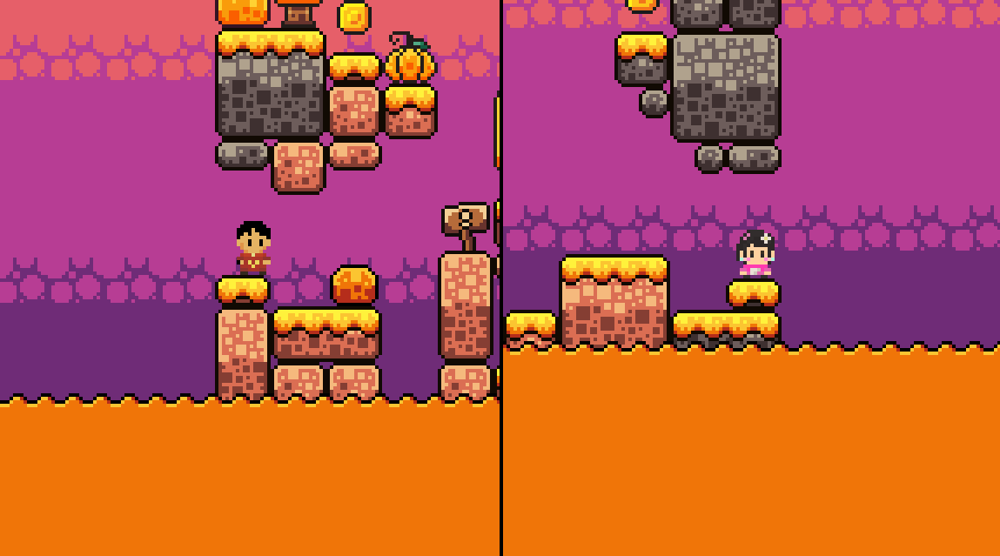
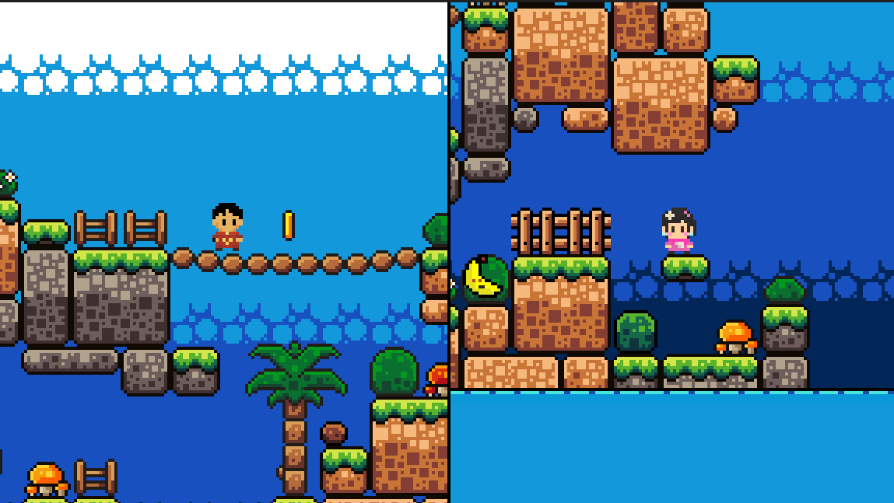
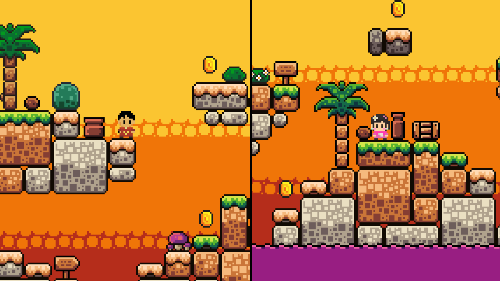
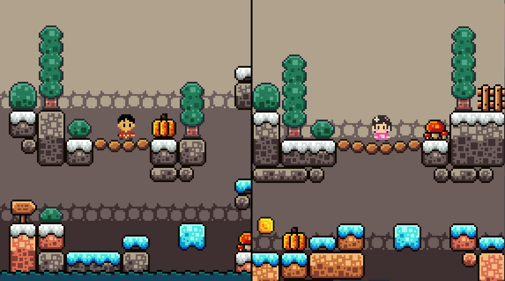
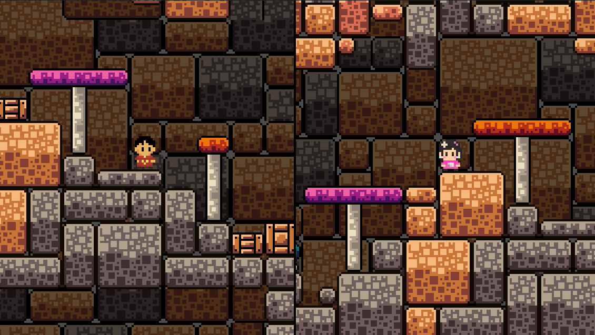

# String Theory 🧬

**String Theory** is a split-screen puzzle platformer where two players spawn on opposite ends of the map. They're *connected* by an invisible string - just like the theory suggests. To complete each level, both players must navigate their own worlds and meet in the middle.

🔗 [Play the Game](https://unix2dos.itch.io/string-theory)

---

#### My Very First Game - Made in 48 Hours for KiwiJam 2025!

The theme of the jam was **"Connections"**, which inspired the idea of two characters tethered by an invisible thread across separate realms.

I built this solo, and it’s my very first real dive into game development. I had no idea how much time programming and debugging would take, but I learned a ton and loved every second of it! 

While I wasn’t able to fully finish the game in time, and some mechanics are still rough around the edges, I’m really proud of how far it got in just two days.

---

#### Screenshots

  
    

  
  

  

---

#### Tileset Credits

**Four Seasons Platformer Tileset** by *Kevin’s Mom’s House*, based on the original by **RottingPixelsUsed**, used under free licenses.

Big thanks to both creators for their amazing pixel art!